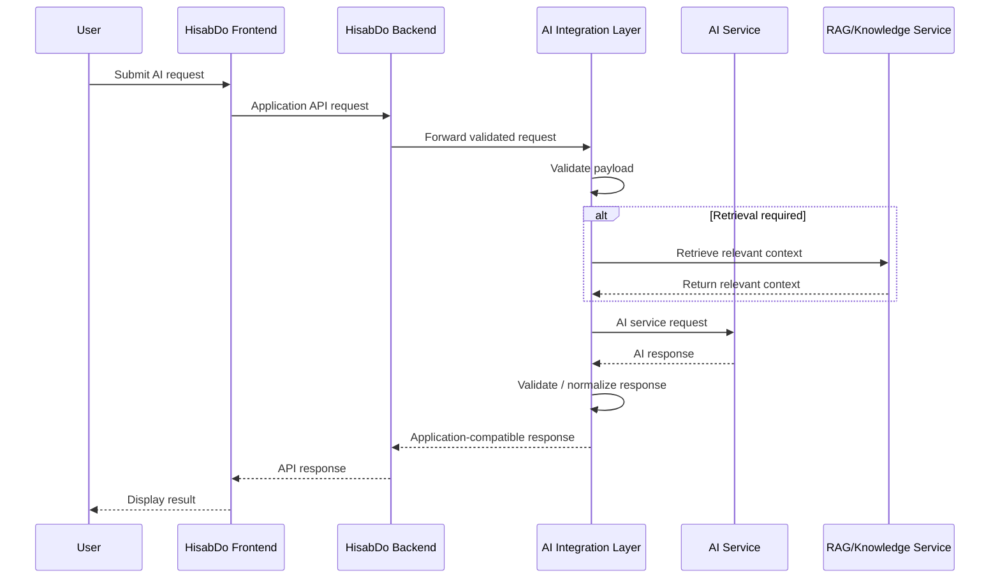

# Day 15 – Application-Facing AI Integration Requirements

**Project:** HisabDo Web App AI  
**Team:** Department 1 – Capstone Development / AI-ML Team  
**Repository:** `usmankhalid172/hisabdo-webapp-ai`  
**Document Path:** `docs/day-15-application-ai-integration.md`  
**Day:** 15  
**Document Status:** Draft for Team Review

---

## 1. Purpose

This document defines the application-facing requirements for integrating HisabDo application components with AI services.

The purpose is to establish a shared integration specification covering:

- application-to-AI communication
- required request data
- expected response data
- API and service dependencies
- frontend and backend integration responsibilities
- validation and error-handling requirements
- application-to-AI request flow
- unresolved questions and dependencies requiring confirmation

This document is a **requirements and integration-planning document**. It does not claim that every proposed API, endpoint, schema, or implementation detail is already deployed or approved.

---

## 2. Scope

The scope of this document covers the application-facing boundary between HisabDo application services and AI capabilities identified in the current AI/ML workstream.

The main capabilities considered are:

1. AI Financial Assistant / Chatbot
2. Smart Expense Categorization
3. Retrieval / Knowledge Base support where applicable
4. AI service / application integration
5. Request and response validation
6. Integration-level error handling and fallback behavior

This document does not define:

- model-training procedures
- dataset-generation procedures
- detailed ML model architecture
- internal LLM implementation details
- production infrastructure
- deployment configuration
- final frontend UI design

Those areas should be handled by the relevant AI/ML, backend, frontend, or infrastructure responsibilities.

---

## 3. Repository and Project Context

The current repository identifies the following AI/ML workstreams:

- AI Financial Assistant / Chatbot
- Smart Expense Categorization
- AI Service / Application Integration
- Testing, Research & Documentation

The repository also reserves:

```text
src/integration/
```

for application-facing integration-related code such as service integration, request/response models, application API logic, and service orchestration.

The `docs/` directory is intended for project documentation such as architecture, API contracts, integration strategy, technical decisions, testing/evaluation evidence, and known blockers.

### Classification

**Confirmed:** The workstreams and repository directory responsibilities above are documented in the current repository.

**Proposed:** The request/response contracts, endpoint examples, and flow definitions in this document are proposed integration designs unless separately confirmed by the relevant team.

---

# 4. Requirement Classification

To avoid treating assumptions as implemented facts, all requirements in this document are classified as follows:

### Confirmed

Information directly supported by the current repository/workspace documentation.

### Proposed

A reasonable technical design suggested for discussion and later implementation.

### TBD / Requires Confirmation

An item that must be confirmed by the responsible development team before the design is treated as final.

---

# 5. Confirmed Project-Level Facts

The following items are confirmed from the current project documentation:

- HisabDo has an AI Financial Assistant / Chatbot workstream.
- HisabDo has a Smart Expense Categorization workstream.
- HisabDo has an AI Service / Application Integration workstream.
- `src/integration/` is designated for application-facing integration-related code.
- `docs/` is designated for technical and integration documentation.
- The project uses shared GitHub development and Pull Request review workflows.
- Secrets such as API keys, tokens, passwords, `.env` files, and sensitive data must not be committed.

These confirmed facts are used as the baseline for the proposed integration requirements below.

---

# 6. Integration Objective

## Proposed

The application should communicate with AI capabilities through a controlled integration boundary instead of coupling the frontend directly to an external AI provider.

Proposed high-level architecture:

```text
HisabDo Frontend
       |
       v
HisabDo Backend
       |
       v
AI Integration Layer
       |
       +--------------------+
       |                    |
       v                    v
Financial AI          Expense AI
Service               Service
       |
       v
RAG / Knowledge Service
       |
       v
LLM / AI Provider
```

The main objective is to provide the HisabDo application with a stable application-facing interface while keeping model/provider-specific details behind the integration boundary.

### Benefits of the proposed design

- frontend does not need direct AI-provider credentials
- provider-specific response formats can be normalized
- request/response validation can be centralized
- integration-level error handling can be standardized
- AI services can evolve without requiring the frontend to depend on provider-specific APIs

---

# 7. Application-to-AI Communication Requirements

## 7.1 Communication Protocol

### Proposed

The application-facing integration should use:

- HTTPS
- REST-style HTTP APIs
- JSON request payloads
- JSON response payloads

The final protocol and endpoint topology require confirmation from the backend and AI/ML teams.

## 7.2 Communication Direction

### Proposed

```text
HisabDo Frontend
        |
        v
HisabDo Backend
        |
        v
AI Integration Layer
        |
        v
AI Service
        |
        v
AI Integration Layer
        |
        v
HisabDo Backend
        |
        v
HisabDo Frontend
```

## 7.3 Security Boundary

### Proposed

The frontend should not directly contain or transmit:

- LLM provider API keys
- model-provider secrets
- internal service credentials
- private backend credentials

AI-provider credentials should remain on trusted server-side components using the approved secret-management mechanism.

---

# 8. Application AI Use Cases

## 8.1 Financial Assistant / Chatbot

### Confirmed

The Financial Assistant / Chatbot is an identified AI/ML workstream.

### Proposed application flow

```text
User
  |
  v
Frontend
  |
  v
Backend
  |
  v
AI Integration Layer
  |
  v
Financial Assistant / RAG / LLM
  |
  v
AI Response
  |
  v
Backend
  |
  v
Frontend
  |
  v
User
```

### Example user request

```text
How much did I spend on food this month?
```

The exact application data available to support such a request requires confirmation from the backend/application team.

---

## 8.2 Smart Expense Categorization

### Confirmed

Smart Expense Categorization is an identified AI/ML workstream.

### Proposed application flow

```text
Transaction
    |
    v
HisabDo Backend
    |
    v
AI Integration Layer
    |
    v
Expense Categorization Service
    |
    v
Predicted Category
    |
    v
Backend
    |
    v
Application
```

The final transaction fields and category set require confirmation from the backend/application and AI/ML teams.

---

# 9. Financial Assistant Request Contract

## Proposed

The application-facing request can use a structure similar to:

```json
{
  "request_id": "string",
  "conversation_id": "string",
  "message": "string",
  "user_id": "string",
  "context": {
    "language": "string",
    "currency": "string"
  }
}
```

### Field planning

| Field | Type | Required | Status | Purpose |
|---|---|---|---|---|
| `request_id` | string | Recommended | Proposed | Request tracing |
| `conversation_id` | string | Recommended | TBD | Conversation/session context |
| `message` | string | Yes | Proposed | User's request |
| `user_id` | string | TBD | TBD | Application user identifier |
| `context` | object | Optional | Proposed | Additional application context |
| `context.language` | string | Optional | Proposed | User/application language |
| `context.currency` | string | Optional | Proposed | Relevant currency |

### Request validation

The integration layer should validate:

- request structure
- required fields
- field types
- message presence and non-empty content
- payload size
- permitted values where applicable
- absence of secrets and unnecessary sensitive information

The exact validation rules require backend/AI confirmation.

---

# 10. Expense Categorization Request Contract

## Proposed

A candidate application-facing request is:

```json
{
  "request_id": "string",
  "transaction": {
    "transaction_id": "string",
    "description": "string",
    "amount": 0.0,
    "currency": "string"
  }
}
```

### Field planning

| Field | Type | Required | Status | Purpose |
|---|---|---|---|---|
| `request_id` | string | Recommended | Proposed | Request tracing |
| `transaction` | object | Yes | Proposed | Transaction information |
| `transaction.transaction_id` | string | TBD | TBD | Application transaction identifier |
| `transaction.description` | string | Yes | Proposed | Transaction description |
| `transaction.amount` | number | Yes | Proposed | Transaction amount |
| `transaction.currency` | string | Yes | Proposed | Currency |

### Open question

The final transaction payload should be based on the actual backend transaction model rather than this example schema.

---

# 11. AI Response Contract

## Proposed

The AI service should return an application-compatible response rather than exposing a provider-specific response format directly to the frontend.

A candidate Financial Assistant response is:

```json
{
  "request_id": "string",
  "status": "success",
  "response": "string",
  "sources": [],
  "metadata": {}
}
```

### Financial Assistant response fields

| Field | Type | Required | Status | Purpose |
|---|---|---|---|---|
| `request_id` | string | Recommended | Proposed | Correlates request and response |
| `status` | string | Yes | Proposed | Processing result |
| `response` | string | Yes on success | Proposed | AI-generated response |
| `sources` | array | Optional | TBD | Retrieved sources, if RAG is used |
| `metadata` | object | Optional | TBD | Additional metadata |

---

# 12. Expense Categorization Response Contract

## Proposed

A candidate response is:

```json
{
  "request_id": "string",
  "status": "success",
  "category": "Entertainment",
  "confidence": 0.94
}
```

### Field planning

| Field | Type | Required | Status | Purpose |
|---|---|---|---|---|
| `request_id` | string | Recommended | Proposed | Request tracing |
| `status` | string | Yes | Proposed | Processing result |
| `category` | string | Yes on success | Proposed | Predicted category |
| `confidence` | number | Recommended | TBD | Model confidence, if available |

The official category vocabulary must be confirmed with the application/backend and AI/ML teams.

---

# 13. Error Response Contract

## Proposed

AI/integration failures should be translated into a predictable application-facing error structure.

Example:

```json
{
  "request_id": "string",
  "status": "error",
  "error": {
    "code": "AI_SERVICE_UNAVAILABLE",
    "message": "The AI service is temporarily unavailable."
  }
}
```

### Proposed error categories

| Error Code | Meaning | Status |
|---|---|---|
| `INVALID_REQUEST` | Invalid request structure | Proposed |
| `VALIDATION_ERROR` | Request validation failed | Proposed |
| `UNAUTHORIZED` | Authentication failure | Proposed |
| `FORBIDDEN` | Authorization failure | Proposed |
| `NOT_FOUND` | Resource/endpoint not found | Proposed |
| `RATE_LIMITED` | Request limit exceeded | Proposed |
| `AI_SERVICE_UNAVAILABLE` | AI service unavailable | Proposed |
| `AI_TIMEOUT` | AI request timed out | Proposed |
| `AI_PROCESSING_ERROR` | AI processing failed | Proposed |
| `INTERNAL_ERROR` | Unexpected integration error | Proposed |

The final error vocabulary and mapping require confirmation.

---

# 14. HTTP Status Code Planning

## Proposed

| HTTP Status | Intended Meaning |
|---:|---|
| `200` | Successful request |
| `400` | Invalid request |
| `401` | Authentication failure |
| `403` | Authorization failure |
| `404` | Resource/endpoint not found |
| `422` | Request validation failure |
| `429` | Rate limit exceeded |
| `500` | Internal service error |
| `503` | AI service unavailable |
| `504` | AI service timeout |

These mappings are planning guidance only and must be aligned with the backend API conventions.

---

# 15. Application-AI End-to-End Flow

## Proposed

```text
1. User submits an AI request
        |
        v
2. Frontend sends the request to the HisabDo backend
        |
        v
3. Backend authenticates and authorizes the request
        |
        v
4. Backend forwards the relevant request to the AI integration layer
        |
        v
5. Integration layer validates the payload
        |
        v
6. Integration layer selects the appropriate AI capability
        |
        v
7. AI service processes the request
        |
        v
8. AI service returns a response
        |
        v
9. Integration layer validates/normalizes the response
        |
        v
10. Backend returns an application-compatible response
        |
        v
11. Frontend renders the result
```

---

# 16. Sequence Diagram

## Proposed



---

# 17. Frontend Integration Requirements

## Proposed

The frontend should:

- communicate with the HisabDo backend rather than directly with an external AI provider
- use the approved application-facing request schema
- show an appropriate loading state during AI processing
- render successful AI responses
- handle structured error responses
- avoid exposing AI provider credentials
- preserve conversation/session context when required
- handle empty or malformed responses safely

## TBD / Questions for Frontend Team

1. Are streamed AI responses required?
2. What exact response fields are required by the UI?
3. Does the UI already support a `conversation_id`?
4. What user-facing fallback should be shown when AI is unavailable?
5. Does the chatbot require persistent conversation history?
6. Is any AI response metadata displayed to users?

---

# 18. Backend Integration Requirements

## Proposed

The backend should:

- authenticate the application user
- authorize access to AI functionality
- validate application data
- construct the AI-facing request
- call the approved integration/service layer
- handle timeouts and retry policies
- normalize AI responses
- map AI/service failures into application-level errors
- keep provider credentials server-side
- avoid logging sensitive user data unnecessarily
- preserve trace identifiers where required

## TBD / Questions for Backend Team

1. What is the existing backend API convention?
2. Will the backend communicate with AI through an internal FastAPI integration service?
3. What authentication mechanism will be used between backend and AI services?
4. What request identifiers already exist in the application?
5. What timeout is acceptable?
6. Which failures should be retried?
7. What rate-limiting policy applies?

---

# 19. AI/ML Integration Requirements

## Proposed

The AI/ML service layer should:

- accept documented request structures
- validate required inputs
- return documented response structures
- return structured errors
- hide provider-specific formats behind the integration layer
- support request tracing where required
- document expected model inputs and outputs
- define model/service limitations
- identify whether confidence values are available
- identify when retrieval/knowledge context is required

## TBD / Questions for AI/ML Team

1. Which AI models/services will be exposed?
2. Which provider will be used for LLM functionality?
3. What service endpoints are available?
4. Is RAG mandatory for any use case?
5. What context must be sent to the model?
6. What metadata will be returned?
7. Are confidence scores available for categorization?
8. What are the expected latency and rate limits?

---

# 20. API and Service Dependencies

| Dependency | Purpose | Responsible Area | Status |
|---|---|---|---|
| HisabDo Frontend | Collect AI inputs and display responses | Frontend | Confirmed application dependency |
| HisabDo Backend | Authentication, orchestration and application API | Backend | Confirmed application dependency |
| AI Integration Layer | Application-facing AI communication | AI/ML / Backend | Confirmed workstream; implementation details TBD |
| Financial Assistant | Natural-language financial support | AI/ML | Confirmed workstream |
| Expense Categorization | Transaction classification | AI/ML | Confirmed workstream |
| RAG / Knowledge Base | Retrieval for context-aware responses | AI/ML | TBD |
| LLM / AI Provider | Natural-language AI processing | AI/ML | TBD |
| Authentication | Secure service communication | Backend / AI/ML | TBD |
| Logging / Monitoring | Request tracing and debugging | Backend / Infrastructure | TBD |

---

# 21. Security Requirements

## Proposed

The integration should follow these security requirements:

### Secrets

Never commit:

- API keys
- access tokens
- passwords
- `.env` files containing secrets
- private credentials

### Data minimization

Only application data required for the specific AI operation should be sent.

The integration should avoid forwarding:

- unrelated personal information
- authentication credentials
- internal secrets
- unnecessary financial/account information

### Provider isolation

Frontend components should not depend directly on:

- LLM provider API keys
- provider-specific credentials
- provider-specific request structures
- provider-specific error responses

---

# 22. Validation Requirements

## Request validation

Before forwarding a request:

- validate content type
- validate JSON structure
- validate required fields
- validate data types
- validate permitted values/ranges
- reject malformed requests
- generate or preserve a request identifier where required
- remove or reject unnecessary sensitive information

## Response validation

Before returning the result to the application:

- validate response structure
- validate required fields
- validate field types
- detect malformed output
- detect service/provider errors
- normalize provider-specific responses into the application contract

---

# 23. Timeout, Retry and Fallback Planning

## Proposed

Because AI services may have variable latency and availability, the integration should define:

### Timeout

A maximum response time for an AI request.

**Status:** TBD

### Retry

A retry policy for temporary failures.

The final policy should specify:

- retryable errors
- maximum retry count
- backoff behavior
- maximum total request duration

**Status:** TBD

### Fallback

When an AI service is unavailable, the application should receive a controlled error response rather than a raw provider exception.

**Status:** Proposed

The final user-facing fallback message requires frontend/product confirmation.

---

# 24. Observability and Request Tracing

## Proposed

Where supported by the application architecture, the integration should use traceable identifiers such as:

```text
request_id
conversation_id
transaction_id
```

The goal is to allow a request to be traced through:

```text
Frontend
   |
Backend
   |
AI Integration Layer
   |
AI Service
   |
AI Integration Layer
   |
Backend
   |
Frontend
```

Logging should not include secrets or unnecessary sensitive financial information.

The exact observability tooling is TBD.

---

# 25. API Versioning

## Proposed

The application-facing API should be versionable.

Example:

```text
/api/v1/...
```

Candidate endpoints for discussion:

```text
POST /api/v1/ai/chat
POST /api/v1/ai/expense-categorize
GET  /api/v1/ai/health
```

These endpoint names are **examples only** and must not be treated as final implementation endpoints without team confirmation.

---

# 26. Integration Data Flow by Use Case

## 26.1 Financial Assistant

```text
User message
    |
    v
Frontend
    |
    v
Backend
    |
    v
AI Integration Layer
    |
    +--> optional RAG / knowledge retrieval
    |
    v
LLM / Financial Assistant
    |
    v
Normalized response
    |
    v
Backend
    |
    v
Frontend
```

## 26.2 Expense Categorization

```text
Transaction data
    |
    v
Backend
    |
    v
AI Integration Layer
    |
    v
Expense Categorization Service
    |
    v
Predicted category
    |
    v
Backend
    |
    v
Application
```

---

# 27. Items Requiring Confirmation

| # | Question | Responsible Team |
|---:|---|---|
| 1 | What is the official AI service base URL? | AI/ML |
| 2 | What are the final AI endpoints? | AI/ML / Backend |
| 3 | What communication protocol is approved? | Backend / AI/ML |
| 4 | What authentication mechanism is required? | Backend / AI/ML |
| 5 | Which request fields are actually available from the backend? | Backend |
| 6 | Which response fields are required by the frontend? | Frontend |
| 7 | Is `conversation_id` already part of the application model? | Backend / Frontend |
| 8 | Is `request_id` already defined elsewhere? | Backend |
| 9 | Are streamed responses required? | Frontend / AI/ML |
| 10 | What timeout should be applied? | Backend / AI/ML |
| 11 | What retry policy should be applied? | Backend / AI/ML |
| 12 | What rate limits apply? | AI/ML |
| 13 | Which LLM/provider will be used? | AI/ML |
| 14 | Is RAG required for the Financial Assistant? | AI/ML |
| 15 | What knowledge sources are authoritative? | AI/ML / Product |
| 16 | What expense categories are officially supported? | Backend / Product |
| 17 | Is a confidence score available for categorization? | AI/ML |
| 18 | What user-facing fallback is expected? | Frontend / Product |
| 19 | What logging/monitoring solution is available? | Backend / Infrastructure |
| 20 | What PR target branch should be used for documentation work? | Team Lead |

---

# 28. Dependency and Blocker List

## Current Dependencies

1. Backend API structure
2. Frontend response requirements
3. AI service endpoint definitions
4. Authentication mechanism
5. Model/provider selection
6. RAG/knowledge-base design
7. Official expense-category definitions
8. Error-handling expectations
9. Timeout and retry policy
10. Monitoring/logging approach

## Current Blockers

The integration specification cannot be treated as final until the relevant teams confirm:

- AI service base URL and endpoints
- application-to-AI authentication
- final request and response schemas
- RAG requirements
- timeout and retry behavior
- frontend response expectations
- official expense categories
- integration observability approach
- final documentation PR target branch, if different from the default workflow

These are **coordination blockers**, not blockers to preparing the proposed requirements document.

---

# 29. Assumptions

## Proposed / Working Assumptions

The following assumptions are used only for planning:

1. The HisabDo backend will remain the trusted application-facing gateway for AI functionality.
2. HTTPS/REST-style communication is acceptable for the integration.
3. JSON can be used for request and response payloads.
4. AI-provider credentials remain server-side.
5. The integration layer can normalize provider-specific responses.
6. Request identifiers can be introduced or reused for tracing.
7. Some Financial Assistant requests may require knowledge retrieval.
8. Expense Categorization may provide a confidence score if the underlying model supports it.

These assumptions must be validated before production implementation.

---

# 30. Confirmed vs Proposed vs TBD Summary

| Area | Confirmed | Proposed | TBD |
|---|---|---|---|
| Financial Assistant workstream | Yes | — | — |
| Expense Categorization workstream | Yes | — | — |
| Integration module | Yes (`src/integration/`) | — | — |
| Documentation location | Yes (`docs/`) | — | — |
| REST/HTTPS | — | Yes | Final confirmation |
| JSON payloads | — | Yes | Final confirmation |
| Backend-mediated AI access | — | Yes | Final topology confirmation |
| Request IDs | — | Yes | Confirm application standard |
| Endpoint names | — | Examples provided | Final API names |
| Request schema | — | Draft | Backend/AI confirmation |
| Response schema | — | Draft | Frontend/AI confirmation |
| Authentication | — | Server-side recommended | Final method |
| RAG | Workstream context exists | Candidate dependency | Final requirement |
| Timeout/retry | — | Required design area | Values/policy |
| Error mapping | — | Structured errors | Final mapping |
| Streaming | — | Considered | Frontend/AI confirmation |

---

# 31. Future Implementation Guidance

This section is intentionally separated from the requirements because Day 15 is primarily an integration-planning task.

## Proposed future implementation structure

```text
src/
└── integration/
    ├── routes/
    ├── schemas/
    ├── services/
    ├── clients/
    └── errors/
```

Possible responsibilities:

- `routes/` — application-facing endpoints
- `schemas/` — request/response validation models
- `services/` — orchestration logic
- `clients/` — communication with AI services
- `errors/` — integration and AI error mapping

The actual module names and implementation structure should follow the team's existing coding conventions.

---

# 32. Future Testing Requirements

Once the integration is implemented, the following tests should be considered.

## Request validation

- missing required field
- empty message
- invalid amount
- invalid transaction structure
- malformed request
- invalid identifier

## Success cases

- Financial Assistant request
- Expense Categorization request
- valid AI response
- valid normalized application response

## Failure cases

- AI timeout
- AI service unavailable
- rate limiting
- invalid AI response
- authentication failure
- internal integration failure

## Security

- provider credentials are not exposed to frontend
- secrets are not logged
- sensitive data is not unnecessarily forwarded
- `.env` or secret files are not committed

---

# 33. Day 15 Completion Evidence

## Work Product

```text
docs/day-15-application-ai-integration.md
```

## GitHub Evidence

```text
Branch:
feature/zainab-raza-application-ai-integration-day-15

Commit:
<TBD after commit>

Pull Request:
<TBD after PR creation>
```

## ClickUp Evidence

The ClickUp Day 15 task should contain:

- completed work summary
- remaining work
- blockers / items requiring confirmation
- branch link
- commit link
- Pull Request link

---

# 34. Day 15 Status

**Status:** Draft for Team Review

### Completed for Day 15 planning

- Application-facing integration requirements documented
- Request/response planning documented
- Application-AI flow documented
- Frontend/backend integration requirements documented
- API/service dependencies documented
- Security and validation requirements documented
- Open questions and blockers documented
- Confirmed, proposed, and TBD items separated

### Remaining

- Confirm final API contract with relevant teams
- Confirm authentication mechanism
- Confirm request/response schemas
- Confirm RAG and model/provider requirements
- Confirm timeout/retry policy
- Confirm frontend response expectations
- Confirm PR target branch for documentation work if required

---

# 35. Document Maintenance

This document should be updated when a previously TBD item is confirmed.

When updating the document:

1. Move confirmed decisions from **TBD** to **Confirmed**.
2. Record major design decisions in the appropriate technical-decision documentation if required.
3. Keep endpoint examples synchronized with the actual implementation.
4. Avoid leaving obsolete assumptions presented as current requirements.

**Document owner:** Day 15 assignee  
**Reviewers:** Relevant AI/ML, Backend, Frontend, and Team Lead stakeholders
